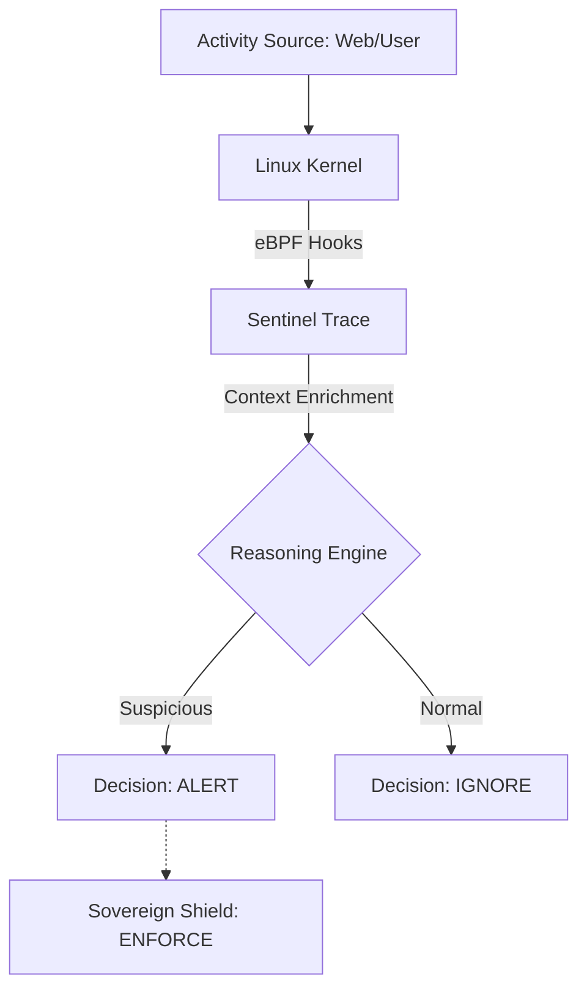
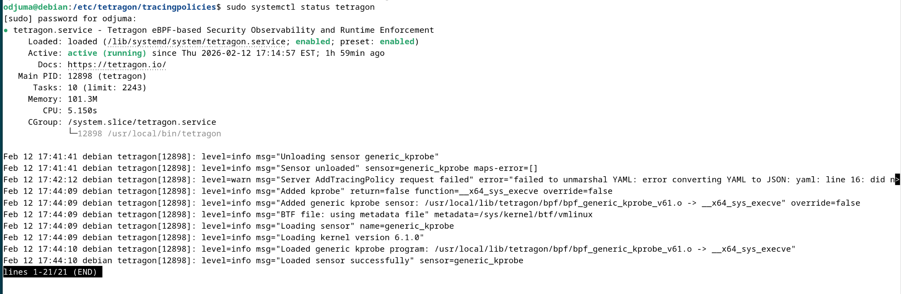
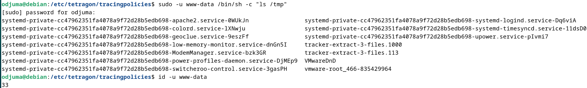
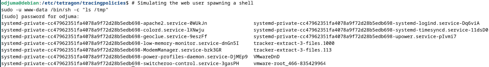
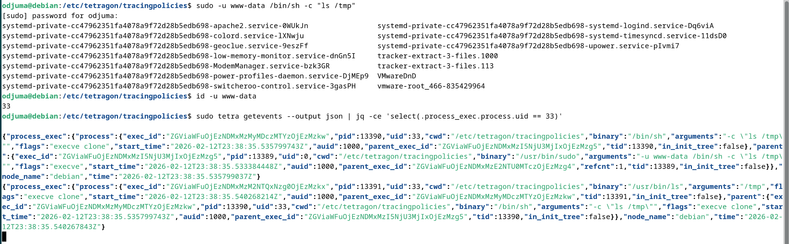

   

   

 

# 🛰️ Sentinel Trace (v1.0 — Genesis)

> ## Note
> *Sentinel Trace is one of the eyeC Triplets*
> 
> *🔗 [Explore the project](https://github.com/eyeC-DevSecOps-project)*

> **"Signals are cheap. Decisions are earned."** > *Behavioral Detection Lab powered by eBPF & Tetragon.*

---

## 🌐 Overview
**Sentinel Trace** is a Blue Team-focused security lab dedicated to **behavioral detection** using low-level system signals. 

While most security tools focus on signatures (what a file *looks* like), Sentinel Trace focuses on **contextual reasoning** (what a process *does*). It observes, contextualizes, and explains suspicious behaviors at the kernel level without modifying applications.

### 🧭 Roadmap
- [x] v1.0 Genesis: Single-signal detection & Manual reasoning.
- [ ] v2.0 Correlation & MITRE Mapping: Reverse Shell & ATT&CK techniques
- [ ] v3.0 Sovereign Bridge: Automated enforcement via Sovereign Shield (Work in Progress).

### Operating Systems
- v1.0: Kali Linux & Debian Linux
- v2.0: Kali Linux, Debian Linux & Metasploitable3

## 🧠 Detection Philosophy: "Reasoning-First"
We move away from noisy, signal-only alerts to focus on **explainable security**:
- ✅ **Context over Isolation:** A shell is not a threat; a shell spawned by `nginx` is.
- ✅ **Kernel-Level Truth:** Using eBPF for tamper-proof telemetry.
- ✅ **Zero Instrumentation:** Security visibility with zero impact on application code.
- ✅ **Evidence-Based:** Every alert must be backed by a clear parent/child process lineage.


---

## 🏗️ Architecture & Integration
Sentinel Trace acts as the **Thinking Brain**, designed to feed high-confidence decisions into the **Sovereign Shield** (the Enforcement Plane).



### 🧪 MVP (Minimum Viable Product) Scenario: Suspicious Shell Spawning (***The Question: Why is a public-facing HTTP service spawning a shell?***)

🔎 Observed Signals
- Event: ``process_exec``
- Parent: ``/usr/sbin/nginx``
- Child: ``/bin/sh``
- Context: UID: 33 (www-data) | Namespace: Runtime

🧠 Sentinel Decision
Status: ❌ SUSPICIOUS Reasoning: An HTTP service (Nginx) has no operational justification to spawn an interactive shell. This pattern is synonymous with Remote Code Execution (RCE) or Web Shell exploitation.

🚀 Quick Start (Standalone Mode)
1. Verify Kernel Support
```
sudo bpftool feature probe kernel | grep "eBPF"
```

3. Install Tetragon Daemon
```
curl -fL -o tetragon.tar.gz [https://github.com/cilium/tetragon/releases/download/v1.6.0/tetragon-v1.6.0-amd64.tar.gz](https://github.com/cilium/tetragon/releases/download/v1.6.0/tetragon-v1.6.0-amd64.tar.gz)
tar -xzf tetragon.tar.gz && cd tetragon-v1.6.0-amd64
sudo ./install.sh
sudo systemctl enable --now tetragon
```

5. Observe the Stream

```
sudo tetra getevents
```

### ⚙️ System Validation
#### ⚙️ Engine & Service Configuration


#### 🛡️ TracingPolicy Injection & Kernel Validation


#### 🛡️ TracingPolicy Deployment


#### 🚨 High-Fidelity Detection Log (The Proof)



## Tips:
***How to check logs***
```
# To follow real-time alerts for the Nginx user:
sudo tetra getevents --output json | jq -ce 'select(.process_exec.process.uid == 33)'
```


## ⚙️ System Integration & Persistence
### Scalable Security Model

---
To transform a **manual laboratory** into a **production-ready security solution**, **Sentinel Trace** applies **Infrastructure as Code (IaC)** principles through two tightly coupled core components.

To ensure continuous runtime monitoring, **Sentinel Trace** is deployed as a `systemd` service. This configuration guarantees that the eBPF hooks are re-attached automatically upon system reboot and provides resilience against service termination.

The service is configured to automatically load all policies located in `/etc/tetragon/tracingpolicies/`. This creates an **evolvable security system**: to update the protection or add new detection rules, you simply drop a new `.yaml` file into the directory. The kernel hooks are updated without any service interruption or application downtime.

---

### 🧩 Core Architecture Further View

```text
┌──────────────────────────┐
│ install.sh               │  → Deployment Engine (IaC)
│ ├─ Directory bootstrap   │
│ ├─ Policy injection      │
│ └─ systemd enablement    │
└────────────┬─────────────┘
             ↓
┌──────────────────────────┐
│ tetragon.service         │  → Persistence Layer
│ ├─ Boot-time protection  │
│ ├─ Auto-restart          │
│ └─ Hot policy loading    │
└──────────────────────────┘
```


## 👤 Author

**O'djuma Badolo**  
Web Developer | Cybersecurity graduate | DevSecOps Enthusiast  
> *"Building secure systems by thinking like the storm."*
